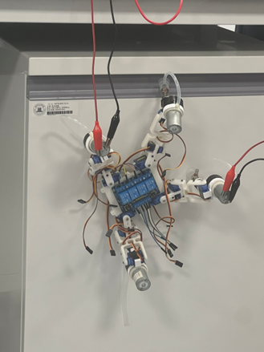
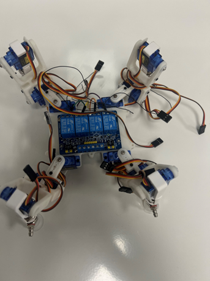

# SpiderBOT: Quadrupedal Wall-Climbing Robot

<p align="center">
  
  
</p>

SpiderBOT is an advanced quadrupedal robot designed for versatile movement on both horizontal surfaces and vertical walls. By integrating a 12-DOF (Degrees of Freedom) kinematic system with a high-pressure negative suction mechanism, SpiderBOT achieves stable climbing on smooth vertical surfaces, mimicking the locomotion of specialized biological climbers.

The system is powered by an **ESP32-S3** microcontroller, which manages real-time inverse kinematics, vacuum adhesion control, and a responsive WebSocket-based web interface for remote operation.

---

## 🚀 Key Features

*   **Dual Locomotion Modes:** 
    *   **Ground Mode:** Optimized trot gait for fast and stable surface navigation.
    *   **Climbing Mode:** Precision crawl gait utilizing 3-point static stability for vertical movement.
*   **12-DOF Kinematic Control:** Independent 3-axis control for each leg (Shoulder, Elbow, and Foot/Wrist) providing high maneuverability.
*   **Active Adhesion System:** Four independent high-pressure vacuum suction cups with real-time solenoid valve control for secure wall attachment.
*   **Wireless Control:** Real-time command and telemetry via a built-in WebServer and WebSockets (low-latency control).
*   **Modern Web UI:** Integrated dashboard for manual control, gait switching, and system status monitoring.
*   **Modular Software Architecture:** Clean separation between hardware definitions, gait logic, and communication protocols.

---

## 🛠 Hardware Components

| Component | Specification | Function |
| :--- | :--- | :--- |
| **Main Controller** | ESP32-S3 DevKitC-1 | Core logic, WiFi, and Web Server |
| **PWM Driver** | PCA9685 (I2C) | 16-channel 12-bit PWM for servo control |
| **Actuators** | 12x High-Torque Servos | 3 joints per leg (Shoulder, Elbow, Foot) |
| **Vacuum System** | 4x Micro Air Pumps | Generates negative pressure for suction cups |
| **Valve System** | 4x Solenoid Valves | Quick-release mechanism for leg lifting |
| **Sensors** | Integrated ESP32 Hall/Internal | System monitoring and telemetry |

---

## 💻 Software Dependencies

The project is built using the **Arduino Framework** within the **PlatformIO** ecosystem.

### Required Libraries
*   **Adafruit PWM Servo Driver Library:** To interface with the PCA9685 via I2C.
*   **ESP32Servo:** For auxiliary servo management.
*   **WebSockets (by links2004):** For low-latency bidirectional communication between the robot and UI.
*   **Adafruit BusIO:** Core dependency for I2C communication.
*   **WiFi & WebServer:** Built-in ESP32 libraries for the control interface.

---

## 🔧 Installation & Build Instructions

1.  **Environment Setup:**
    *   Install [Visual Studio Code](https://code.visualstudio.com/).
    *   Install the [PlatformIO IDE](https://platformio.org/platformio-ide) extension.
2.  **Clone the Repository:**
    ```bash
    git clone https://github.com/your-repo/SpiderBOT.git
    cd SpiderBOT
    ```
3.  **Configuration:**
    *   Open `src/gruandbot/Definitions.cpp`.
    *   Update `WIFI_SSID` and `WIFI_PASSWORD` with your network credentials.
4.  **Hardware Wiring:**
    *   Connect the PCA9685 to the ESP32-S3 (SDA: GPIO 21, SCL: GPIO 22).
    *   Connect the air pump control pins to GPIOs 2, 3, 4, and 5 (as defined in `PUMP_PINS`).
5.  **Build and Flash:**
    *   Click the **PlatformIO: Build** icon in the status bar.
    *   Click the **PlatformIO: Upload** icon to flash the firmware to the ESP32-S3.

---

## 🎮 Usage

1.  **Power On:** Ensure the robot is powered by a high-current source (e.g., 2S LiPo battery) to support the 12 servos and 4 air pumps.
2.  **Connect:**
    *   The robot will connect to your WiFi or host its own AP (depending on configuration).
    *   Check the Serial Monitor (115200 baud) for the assigned IP address.
3.  **Operation:**
    *   Open a web browser and navigate to the robot's IP address.
    *   Use the dashboard to toggle between **Ground** and **Climb** modes.
    *   Control movements (Forward, Backward, Left, Right) and actions (Stand, Sit, Dance) via the UI buttons.

---

## 📁 Directory Structure

```text
SpiderBOT/
├── src/gruandbot/        # Core Software Logic
│   ├── main.cpp          # Entry point and setup
│   ├── ground.cpp/h      # Inverse kinematics and gait implementations
│   ├── Definitions.cpp   # Pin mapping and constant configurations
│   ├── crawl_gait_climb.cpp # Specialized wall-climbing gait logic
│   └── index.h           # Embedded HTML/CSS/JS for the control UI
├── Example/              # Reference code for peripheral testing
│   ├── Airpump/          # Vacuum system test scripts
│   ├── wire/             # PCA9685 I2C communication tests
│   └── WebServer/        # Connectivity test examples
├── Flowchart/            # System architecture and logic diagrams
└── platformio.ini        # Project dependencies and build settings
```
